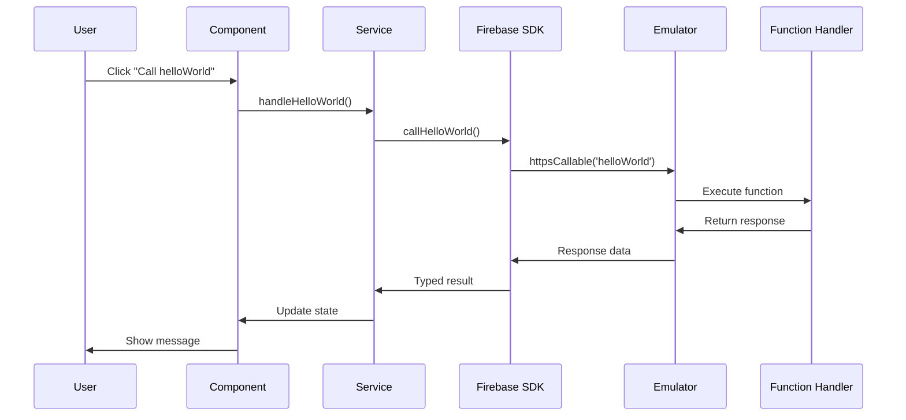
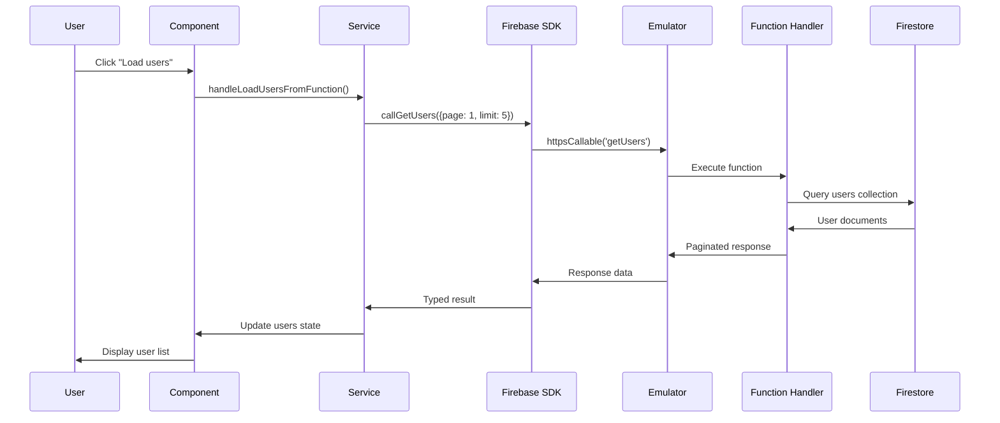
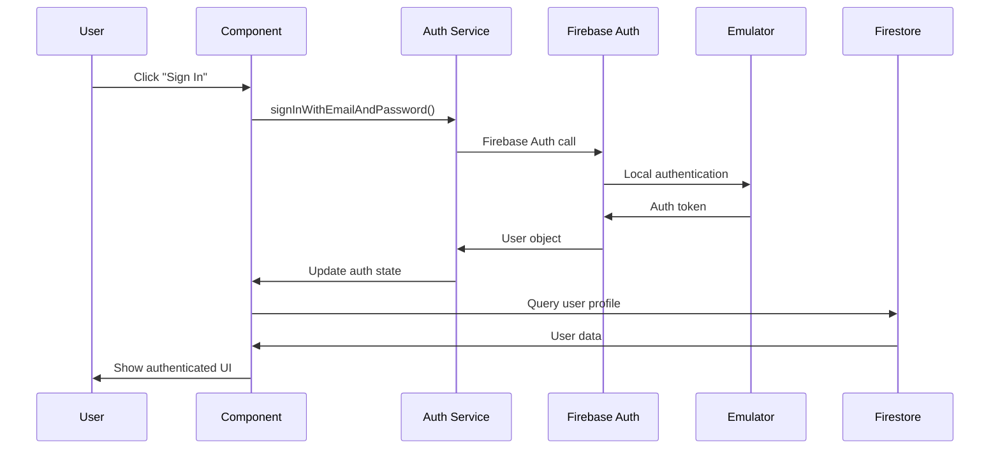

# Data Flow Architecture

## 🔄 Overview

This document details how data flows through the React + Firebase template, from user interactions to database operations and back to the UI.

## 📊 Data Flow Diagram

```
┌─────────────────┐    ┌─────────────────┐    ┌─────────────────┐
│   User Input    │    │  React State    │    │  Service Layer  │
│                 │    │                 │    │                 │
│ • Button Click  │───▶│ • useState      │───▶│ • API Calls     │
│ • Form Submit   │    │ • useEffect     │    │ • Validation    │
│ • Navigation    │    │ • Event Handlers│    │ • Error Handling│
└─────────────────┘    └─────────────────┘    └─────────────────┘
                                │                       │
                                ▼                       ▼
┌─────────────────┐    ┌─────────────────┐    ┌─────────────────┐
│  Firebase SDK   │    │  Functions      │    │  Firestore     │
│                 │    │                 │    │                 │
│ • httpsCallable │◀───│ • HTTP/Callable │◀───│ • Collections  │
│ • connectEmulator│   │ • CORS          │    │ • Documents     │
│ • Auth          │    │ • Validation    │    │ • Security Rules│
└─────────────────┘    └─────────────────┘    └─────────────────┘
                                │                       │
                                ▼                       ▼
┌─────────────────┐    ┌─────────────────┐    ┌─────────────────┐
│  Response Data  │    │  Type Safety    │    │  UI Update      │
│                 │    │                 │    │                 │
│ • Success       │───▶│ • Zod Schemas   │───▶│ • Component     │
│ • Error         │    │ • TypeScript    │    │ • Re-render     │
│ • Loading       │    │ • Interfaces    │    │ • User Feedback │
└─────────────────┘    └─────────────────┘    └─────────────────┘
```

## 🎯 Detailed Flow Examples

### 1. Hello World Function Call



**Code Flow:**
```typescript
// 1. User clicks button
const handleHelloWorld = async () => {
  try {
    // 2. Service layer call
    const res = await callHelloWorld()
    // 3. Update component state
    setServerMessage(res.data?.message ?? 'No message')
  } catch (error) {
    // 4. Error handling with fallback
    handleError(error)
  }
}

// 5. Service layer implementation
export async function callHelloWorld(): Promise<ApiResponse<{ message: string }>> {
  const fn = httpsCallable(functionsInstance, 'helloWorld')
  const res = await fn()
  return res.data as ApiResponse<{ message: string }>
}
```

### 2. User Data Retrieval



**Code Flow:**
```typescript
// 1. Component handler
const handleLoadUsersFromFunction = async () => {
  const res = await callGetUsers({ page: 1, limit: 5 })
  if (res.success && res.data) setUsers(res.data)
}

// 2. Service layer
export async function callGetUsers(params: Pick<PaginationParams, 'page' | 'limit'>): Promise<PaginatedResponse<User>> {
  const fn = httpsCallable(functionsInstance, 'getUsers')
  const res = await fn(params)
  return res.data as PaginatedResponse<User>
}

// 3. Function handler (backend)
export const getUsers = onCall<Pick<PaginationParams, 'page' | 'limit'>>(
  { cors: true },
  async (request) => {
    const { page = 1, limit = 10 } = request.data
    
    try {
      const usersRef = db.collection(COLLECTIONS.USERS)
      const snapshot = await usersRef
        .orderBy('createdAt', 'desc')
        .limit(limit)
        .offset((page - 1) * limit)
        .get()
      
      const users = snapshot.docs.map(doc => ({
        id: doc.id,
        ...doc.data()
      })) as User[]
      
      return createSuccessResponse(users, 'Users loaded successfully')
    } catch (error) {
      return createErrorResponse('Failed to load users', error)
    }
  }
)
```

## 🔄 State Management Flow

### Component State Lifecycle

```typescript
// 1. Initial State
const [users, setUsers] = useState<User[]>([])
const [loading, setLoading] = useState(false)
const [error, setError] = useState<string | null>(null)

// 2. Loading State
const handleLoadUsers = async () => {
  setLoading(true)
  setError(null)
  
  try {
    const res = await callGetUsers({ page: 1, limit: 5 })
    if (res.success && res.data) {
      setUsers(res.data)
    } else {
      setError(res.error || 'Failed to load users')
    }
  } catch (err) {
    setError(err instanceof Error ? err.message : 'Unknown error')
  } finally {
    setLoading(false)
  }
}

// 3. UI Rendering
return (
  <div>
    {loading && <LoadingSpinner />}
    {error && <ErrorMessage message={error} />}
    {users.map(user => (
      <UserCard key={user.id} user={user} />
    ))}
  </div>
)
```

## 📡 API Communication Flow

### Request/Response Pattern

```typescript
// 1. Request Structure
interface ApiRequest<T> {
  data: T
  timestamp: number
  requestId: string
}

// 2. Response Structure
interface ApiResponse<T> {
  success: boolean
  data?: T
  error?: string
  message: string
  timestamp: number
}

// 3. Error Handling
interface ApiError {
  code: string
  message: string
  details?: any
  timestamp: number
}
```

### CORS and Authentication Flow

```typescript
// 1. Frontend Request
const functions = getFunctions(app)
if (useEmulator) {
  connectFunctionsEmulator(functions, 'localhost', 5101)
}

// 2. Function Call
const helloWorld = httpsCallable(functions, 'helloWorld')
const result = await helloWorld()

// 3. Backend Processing
export const helloWorld = onRequest(
  { cors: true }, // Allows cross-origin requests
  (request, response) => {
    // Handle CORS preflight
    response.set('Access-Control-Allow-Origin', '*')
    response.set('Access-Control-Allow-Methods', 'GET, POST')
    response.set('Access-Control-Allow-Headers', 'Content-Type')
    
    // Process request
    const message = 'Hello from Firebase Functions v2 in Europe West 2!'
    response.json({ success: true, data: { message }, timestamp: Date.now() })
  }
)
```

## 🔐 Authentication Flow

### User Authentication Process



**Code Implementation:**
```typescript
// 1. Authentication Service
export const authService = {
  async signIn(email: string, password: string) {
    try {
      const userCredential = await signInWithEmailAndPassword(auth, email, password)
      return createSuccessResponse(userCredential.user, 'Signed in successfully')
    } catch (error) {
      return createErrorResponse('Authentication failed', error)
    }
  },
  
  async signOut() {
    try {
      await signOut(auth)
      return createSuccessResponse(null, 'Signed out successfully')
    } catch (error) {
      return createErrorResponse('Sign out failed', error)
    }
  }
}

// 2. Component Integration
const [user, setUser] = useState<User | null>(null)

useEffect(() => {
  const unsubscribe = onAuthStateChanged(auth, (firebaseUser) => {
    if (firebaseUser) {
      // User is signed in, fetch profile
      fetchUserProfile(firebaseUser.uid)
    } else {
      setUser(null)
    }
  })
  
  return unsubscribe
}, [])
```

## 📊 Real-time Data Flow

### Firestore Listeners

```typescript
// 1. Real-time User Updates
useEffect(() => {
  if (!userId) return
  
  const unsubscribe = onSnapshot(
    doc(db, COLLECTIONS.USERS, userId),
    (doc) => {
      if (doc.exists()) {
        const userData = { id: doc.id, ...doc.data() } as User
        setUser(userData)
      }
    },
    (error) => {
      console.error('Error listening to user updates:', error)
    }
  )
  
  return unsubscribe
}, [userId])

// 2. Collection Listeners
useEffect(() => {
  const unsubscribe = onSnapshot(
    query(
      collection(db, COLLECTIONS.POSTS),
      orderBy('createdAt', 'desc'),
      limit(10)
    ),
    (snapshot) => {
      const posts = snapshot.docs.map(doc => ({
        id: doc.id,
        ...doc.data()
      })) as Post[]
      setPosts(posts)
    }
  )
  
  return unsubscribe
}, [])
```

## 🚨 Error Handling Flow

### Comprehensive Error Strategy

```typescript
// 1. Service Layer Error Handling
export async function callHelloWorld(): Promise<ApiResponse<{ message: string }>> {
  try {
    const fn = httpsCallable(functionsInstance, 'helloWorld')
    const res = await fn()
    return res.data as ApiResponse<{ message: string }>
  } catch (error) {
    // Log error for debugging
    console.error('Function call error:', error)
    
    // Return structured error response
    return {
      success: false,
      error: error instanceof Error ? error.message : 'Unknown error',
      message: 'Function call failed',
      timestamp: Date.now()
    }
  }
}

// 2. Component Error Boundaries
class ErrorBoundary extends React.Component {
  constructor(props) {
    super(props)
    this.state = { hasError: false, error: null }
  }
  
  static getDerivedStateFromError(error) {
    return { hasError: true, error }
  }
  
  componentDidCatch(error, errorInfo) {
    console.error('Error caught by boundary:', error, errorInfo)
  }
  
  render() {
    if (this.state.hasError) {
      return <ErrorFallback error={this.state.error} />
    }
    return this.props.children
  }
}

// 3. User-Friendly Error Messages
const getErrorMessage = (error: any): string => {
  if (error?.code === 'functions/unavailable') {
    return 'Service temporarily unavailable. Please try again.'
  }
  if (error?.code === 'functions/permission-denied') {
    return 'You do not have permission to perform this action.'
  }
  return 'An unexpected error occurred. Please try again.'
}
```

## 🔄 Data Validation Flow

### Input Validation Pipeline

```typescript
// 1. Frontend Validation
const validateUserInput = (input: Partial<User>): ValidationResult => {
  try {
    const validated = UserSchema.parse(input)
    return { success: true, data: validated }
  } catch (error) {
    if (error instanceof ZodError) {
      return { 
        success: false, 
        errors: error.errors.map(e => e.message)
      }
    }
    return { success: false, errors: ['Validation failed'] }
  }
}

// 2. Backend Validation
export const createUser = onCall<CreateUser>(
  { cors: true },
  async (request) => {
    try {
      // Validate input data
      const userData = CreateUserSchema.parse(request.data)
      
      // Check if user already exists
      const existingUser = await getUserByEmail(userData.email)
      if (existingUser) {
        return createErrorResponse('User already exists')
      }
      
      // Create user document
      const userRef = await db.collection(COLLECTIONS.USERS).add({
        ...userData,
        createdAt: serverTimestamp(),
        updatedAt: serverTimestamp()
      })
      
      const newUser = { id: userRef.id, ...userData }
      return createSuccessResponse(newUser, 'User created successfully')
    } catch (error) {
      if (error instanceof ZodError) {
        return createErrorResponse('Invalid input data', error.errors)
      }
      return createErrorResponse('Failed to create user', error)
    }
  }
)
```

## 📈 Performance Optimization Flow

### Data Loading Strategies

```typescript
// 1. Lazy Loading
const LazyAboutPage = lazy(() => import('./pages/AboutPage'))

// 2. Pagination
const [users, setUsers] = useState<User[]>([])
const [hasMore, setHasMore] = useState(true)
const [page, setPage] = useState(1)

const loadMoreUsers = async () => {
  const res = await callGetUsers({ page: page + 1, limit: 10 })
  if (res.success && res.data) {
    setUsers(prev => [...prev, ...res.data!])
    setPage(prev => prev + 1)
    setHasMore(res.data.length === 10)
  }
}

// 3. Debounced Search
const [searchTerm, setSearchTerm] = useState('')
const debouncedSearchTerm = useDebounce(searchTerm, 300)

useEffect(() => {
  if (debouncedSearchTerm) {
    searchUsers(debouncedSearchTerm)
  }
}, [debouncedSearchTerm])

// 4. Memoized Components
const UserList = memo(({ users }: { users: User[] }) => (
  <div className="space-y-4">
    {users.map(user => (
      <UserCard key={user.id} user={user} />
    ))}
  </div>
))
```

This data flow architecture ensures efficient, type-safe, and maintainable data handling throughout the application.


